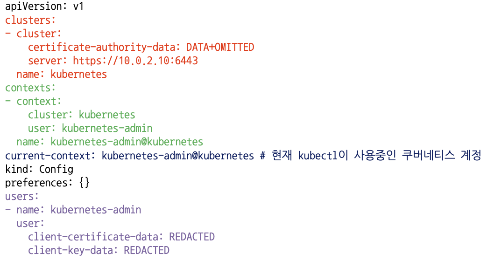

# Intro

Kubernetes Basic 포스트 시리즈는 Kubernetes/Infra에서 필요한 가장 기본적인 개념들만 간략하게 소개합니다. 실제로는 더 많은 내용들이 있고, 여기에 소개된 것은 극히 일부임을 밝힙니다. 이 문서의 목적은 복잡한 의사 결정을 최대한 줄이고 빠르게 Kubernetes를 사용하고 또 필요한 개념들을 소개하는데 있습니다. 더 상세한 내용은 인터넷에 공개된 공식 문서 혹은 각 개념에 대해 자세히 설명한 글들을 참조하는 것이 좋고, 이 시리즈에서도 그러한 글들의 주소들을 첨부하고 있습니다.

# Basic

## Kubernetes 조작

Kubernetes 클러스터가 구성된 상태에서, Kubernetes를 조작하기 위해서는 다음 두 가지가 필요합니다.

- 구성된 [클러스터의 인증 파일](##Kube-config)이 먼저 로컬에 갖춰져 있어야 합니다.
- 모든 쿠버네티스 조작은 기본적으로 [kubectl](##kubectl)이라는 제어 도구를 사용해서 조작합니다. kubectl이 설치되어 있어야 합니다.  

## Kube config

### kube config

Kubernetes는 기본적으로 `~/.kube/config` 파일을 참조하여 클러스터를 조작합니다. 따라서, 클러스터를 조작할 로컬 환경(대부분의 경우 노트북이나 맥북이 될 것입니다.)내 다음과 같은 `~/.kube/config` 파일이 있어야 합니다.

  
[이미지 출처](https://freedeveloper.tistory.com/425)


### 클러스터 여러 개 조작

클러스터를 추가로 사용하고 싶다면 `~/.kube/config`내 `clusters`, `contexts`, `users` 항목에 각각 알맞은 값을 추가해 주면 됩니다.([참고](https://kubernetes.io/ko/docs/tasks/access-application-cluster/configure-access-multiple-clusters/))  
이후 current-context를 사용하고 싶은 클러스터의 context로 바꾸면 됩니다. current-context를 바꾸는 방법은 [kubectl config](###kubectl-config)의 `use-context`에 소개되어 있습니다. 위 이미지 예의 경우, 다음과 같은 명령어로 current-context를 선택합니다.

```bash
kubectl config use-context kubernetes-admin@kubernetes
```

## Kubectl

- 설치 방법 : [Kubectl installation](https://kubernetes.io/ko/docs/tasks/tools/)

`kubectl`은 Kubernetes에서 사용하는 기본 클러스터 조작 도구입니다. 대부분의 Kubernetes 작업을 이 도구를 사용하여 수행하게 될 것입니다. [치트시트](https://kubernetes.io/ko/docs/reference/kubectl/cheatsheet/)에서 더 많은 `kubectl` 명령어와 정보들을 얻을 수 있습니다.

### kubectl get

`kubectl get`은 현재 클러스터에 존재하는 객체들을 검색하는 명령어 입니다. 용례는 다음과 같습니다.

```bash
# 기본 출력을 위한 Get 커맨드
kubectl get services                          # 네임스페이스 내 모든 서비스의 목록 조회
kubectl get pods --all-namespaces             # 모든 네임스페이스 내 모든 파드의 목록 조회
kubectl get pods -o wide                      # 해당하는 네임스페이스 내 모든 파드의 상세 목록 조회
kubectl get deployment my-dep                 # 특정 디플로이먼트의 목록 조회
kubectl get pods                              # 네임스페이스 내 모든 파드의 목록 조회
kubectl get pod my-pod -o yaml                # 파드의 YAML 조회  
```

### kubectl describe

`kubectl describe`는 `kubectl get` 보다 더 상세한 정보들을 제공합니다. 노드의 cpu 점유율, Pod에서 일어난 이벤트등을 조회하고 싶다면 `kubectl describe`를 사용해야 합니다.

```bash
# 상세 출력을 위한 Describe 커맨드
kubectl describe nodes my-node
kubectl describe pods my-pod
```

### kubectl apply/create

`kubectl apply`와 `kubectl create`는 Kubernetes 객체를 생성합니다. `kubectl apply`는 객체의 업데이트까지 수행합니다.

~~~bash
kubectl apply -f ./my-manifest.yaml            # 리소스(들) 생성
kubectl apply -f ./my1.yaml -f ./my2.yaml      # 여러 파일로 부터 생성
kubectl apply -f ./dir                         # dir 내 모든 매니페스트 파일에서 리소스(들) 생성
kubectl apply -f https://git.io/vPieo          # url로부터 리소스(들) 생성
kubectl create deployment nginx --image=nginx  # nginx 단일 인스턴스를 시작
~~~

### kubectl delete

`kubectl delete`는 생성된 kubernetes 객체를 삭제합니다.

~~~bash
kubectl delete -f ./pod.json                                              # pod.json에 지정된 유형 및 이름을 사용하여 파드 삭제
kubectl delete pod,service baz foo                                        # "baz", "foo"와 동일한 이름을 가진 파드와 서비스 삭제
kubectl delete pods,services -l name=myLabel                              # name=myLabel 라벨을 가진 파드와 서비스 삭제
kubectl delete pods,services -l name=myLabel --include-uninitialized      # 초기화되지 않은 것을 포함하여, name=myLabel 라벨을 가진 파드와 서비스 삭제
kubectl -n my-ns delete pod,svc --all                                      # 초기화되지 않은 것을 포함하여, my-ns 네임스페이스 내 모든 파드와 서비스 삭제
# awk pattern1 또는 pattern2에 매칭되는 모든 파드 삭제
kubectl get pods  -n mynamespace --no-headers=true | awk '/pattern1|pattern2/{print $1}' | xargs  kubectl delete -n mynamespace pod
~~~

### kubectl config

`kubectl config`은 클러스터 설정과 관련된 행동을 수행합니다.

```bash
kubectl config view # 병합된 kubeconfig 설정을 표시한다.

# 동시에 여러 kubeconfig 파일을 사용하고 병합된 구성을 확인한다
KUBECONFIG=~/.kube/config:~/.kube/kubconfig2

kubectl config view

# e2e 사용자의 암호를 확인한다
kubectl config view -o jsonpath='{.users[?(@.name == "e2e")].user.password}'

kubectl config view -o jsonpath='{.users[].name}'    # 첫 번째 사용자 출력
kubectl config view -o jsonpath='{.users[*].name}'    # 사용자 리스트 조회
kubectl config get-contexts                          # 컨텍스트 리스트 출력
kubectl config current-context              # 현재 컨텍스트 출력
kubectl config use-context my-cluster-name  # my-cluster-name를 기본 컨텍스트로 설정

# 기본 인증을 지원하는 새로운 사용자를 kubeconf에 추가한다
kubectl config set-credentials kubeuser/foo.kubernetes.com --username=kubeuser --password=kubepassword

# 해당 컨텍스트에서 모든 후속 kubectl 커맨드에 대한 네임스페이스를 영구적으로 저장한다
kubectl config set-context --current --namespace=ggckad-s2

# 특정 사용자와 네임스페이스를 사용하는 컨텍스트 설정
kubectl config set-context gce --user=cluster-admin --namespace=foo \
  && kubectl config use-context gce

kubectl config unset users.foo                       # foo 사용자 삭제
```

### kubectl logs

`kubectl logs`는 Pod의 로그를 검색해 확인합니다. 오류가 난 Pod의 오류/종료 원인을 파악하는데 사용할 수 있습니다.

```bash
kubectl logs my-pod                                 # 파드 로그 덤프 (stdout)
kubectl logs -l name=myLabel                        # name이 myLabel인 파드 로그 덤프 (stdout)
kubectl logs my-pod --previous                      # 컨테이너의 이전 인스턴스 생성에 대한 파드 로그 덤프 (stdout)
kubectl logs my-pod -c my-container                 # 파드 로그 덤프 (stdout, 멀티-컨테이너 경우)
kubectl logs -l name=myLabel -c my-container        # name이 myLabel인 파드 로그 덤프 (stdout)
kubectl logs my-pod -c my-container --previous      # 컨테이너의 이전 인스턴스 생성에 대한 파드 로그 덤프 (stdout, 멀티-컨테이너 경우)
kubectl logs -f my-pod                              # 실시간 스트림 파드 로그(stdout)
kubectl logs -f my-pod -c my-container              # 실시간 스트림 파드 로그(stdout, 멀티-컨테이너 경우)
kubectl logs -f -l name=myLabel --all-containers    # name이 myLabel인 모든 파드의 로그 스트리밍 (stdout)
```

## Yaml spec file

`kubectl apply -f`로 Kubernetes 오브젝트를 생성할 때, Yaml 파일 형식으로 오브젝트의 spec을 기술해서 생성할 수 있습니다.

간단한 Nginx의 Pod Spec yaml 파일입니다.

```yaml
# from https://kubernetes.io/ko/docs/concepts/workloads/pods/
# nginx.yaml
apiVersion: v1
kind: Pod
metadata:
  name: nginx
spec:
  containers:
  - name: nginx
    image: nginx:1.14.2
    ports:
    - containerPort: 80
```

위 파일을 작성한 뒤, 아래 명령어를 실행합니다.

```bash
kubectl apply -f nginx.yaml
```

명령어를 실행하면 Kubernetes 클러스터에 nginx Pod가 생성됩니다.

로컬 파일뿐만 아니라, 온라인에 작성된 yaml 파일이 있다면 이를 참조하는 것도 가능합니다.

```bash
kubectl apply -f https://k8s.io/examples/pods/simple-pod.yaml
```

이 명령어는 온라인에 작성된 `simple-pod.yaml`을 사용합니다. 이는 로컬 파일을 사용했을 때와 같은 행동을 수행합니다.
Yaml 작성 문법은 [Kubernetes API 문서](https://kubernetes.io/docs/reference/generated/kubernetes-api/v1.23/)를 참고합니다.